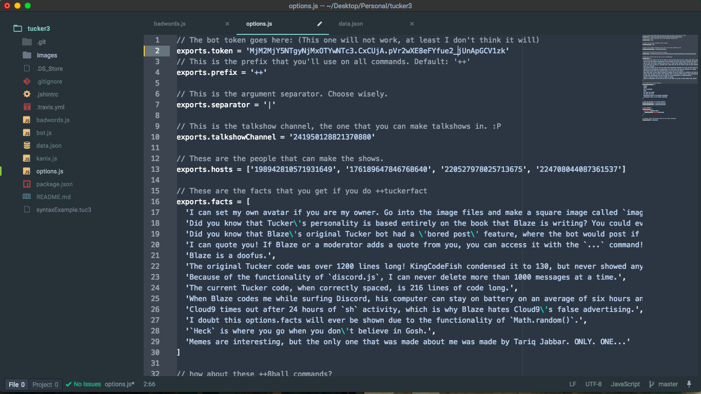

# Tucker2
A made-from-scratch easy-to-use Discord bot with too many hyphens.


### Originally created by BlazeProgramming...
...for use on the Khan Academy Discord Server, with many Khan-Academy-specific commands.

### Now available to use on...
...ANY discord server (with a bit of configuration, hehe).

## Dependencies
* [Node.js](https://nodejs.org/)
* [discord.js](https://github.com/hydrabolt/discord.js/)
* [request](https://www.npmjs.com/package/request)
* [homoglyph-search](https://www.npmjs.com/package/homoglyph-search)

## Stuff
* [Team Members](#team-members)
* [Commands](#commands)
* [Personal Setup](#personal-setup)
* [Personal Commands](#personal-commands)

## Team Members
(Or people who have helped a lot to develop the bot)
* BlazeProgramming
* KingCodeFish
* Raumaankidwai
* EytukanStudios

## Commands
* Talkshow Commands
  * startshow
  * endshow
  * statistics
  * addguest
  * remguest
* Functionality
  * help
  * kill
  * afk
  * avatar
  * delete
* Bash Shell
  * shell (courtesy of Raumaankidwai)
* Fun
  * tr8r
  * tuckerfacts
  * 8ball
  * cat
  * dog
* Word game (WIP)
  * join
  * leave
  * submit
  * object
  * word
* Quotes (WIP)
  * .
  * ..
  * ...
  * ....

## Personal Setup
When you want to set up your own personal Tucker bot (which is highly doubtful, but hey, you're here):

1. If you're a Git noob, just click the button to clone the repository. If you're a pro, use `git clone` because it's cooler.

2. You should have a folder that says Tucker2-master or Tucker2-beta on your desktop or wherever you chose to put it. Inside, you should have a few key files:
```
badwords.js
options.js
data.json
```
Open each of them up in the text editor of your choice. I'm using [Atom](https://atom.io/) because I'm cool and I actually do things with it.

3. Start in `badwords.js`. You should see something like
```javascript
exports.words = [
  "\u2442\u1441"
]
```
or something like that. In there, place all the words that you would like Tucker to redact. If you don't want that feature at all, then just don't put anything in that list. It won't redact anything else.

4. You can close that out now and move on to `options.js`. You should see a whole bunch of `exports.stuff` calls. The file does a pretty good job of outlining what those are. I'm just going to quickly go over getting the token here. If you already know how to get the token, skip to step 9.


5. Go [here](https://www.discordapp.com/developers/applications/@me) and click "Create a New Application". Go through the steps there. You only need a name and an avatar.

6. Then click the button at the bottom that I've forgotten the name of. It should be "submit" or something like that.

7. Then when the page loads, click the button in the dead center that says "Create a Bot User" or "Bundle a Bot User" or some random thing like that. Click Yes.

8. You should be able to click the **token** button now.

9. Copy the token and place it on the Token line in `options.js`.

  THE BOT WILL *NOT* WORK UNLESS YOU PLACE THE CORRECT TOKEN IN OPTIONS.JS! I DO NOT WANT TO HEAR ABOUT YOUR BOT NOT WORKING BECAUSE YOU PASTED THE WRONG TOKEN!!

10. Finish the instructions in `options.js`. Do not touch the `exports.jsonFile` part.

11. Open a Terminal or Command Prompt Shell.

12. ```Bash
$ cd path/to/tucker/folder
$ npm install discord.js
$ npm install request
$ npm install homoglyph-search
```


13. In the future, you'll be able to simply `npm install`. I simply haven't been able to figure out the `package.json` dependencies.

14. ```Bash
$ node bot.js
```

14. And you're done! Your Tucker instance should come online and should be ready for meeting your command-y needs!

## Personal Commands
You can add your own commands using a system from options.js.

Begin with your function name. I'll use `ping` for example. My code will be as follows:
```javascript
exports.commands = {

  // [...]

  ping () {

  }

  // [...]

}
```
Each function takes message and message arguments as parameters. You can include them here.
```javascript
exports.commands = {

  // [...]

  ping (message, args) {

  }

  // [...]

}
```
* message [Object]: An object with many properties about the message itself. See [this](https://discord.js.org/#!/docs/tag/master/class/Message) for more information.
* args [Array]: An array of arguments, separated by the separator you should define in the options when you set up the bot.

You can use any discord.js code you would like in the commands. The code I'm adding comes straight from their website:
```javascript
exports.commands = {

  // [...]

  ping (message, args) {
    // if the message is "ping", send "pong" to the same channel.
    message.channel.sendMessage('pong')
  }

  // [...]

}
```

Save the file and reload the bot. Your custom command should be implemented! Good luck!
